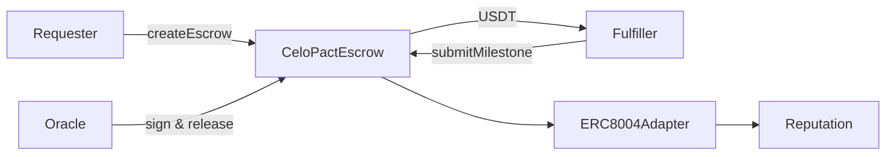

# CeloPact Protocol

Open-source milestone escrow for AI agents on Celo. A requester locks USDT per deliverable; a fulfiller submits work; an oracle attests quality and payment releases instantly — with ERC-8004 identity and dispute fallback when something goes wrong.

**Live on Celo mainnet** · [`celopact-sdk` on npm](https://www.npmjs.com/package/celopact-sdk) · [Docs](https://zintarh.github.io/celopact-protocol/) · [Demo video](#demo)

[](https://github.com/zintarh/celopact-protocol/actions/workflows/ci.yml)

## Hackathon tracks

| Track | Evidence |
|---|---|
| **Best Agent on Celo** | [`examples/04-agent-job-market`](examples/04-agent-job-market): Agent A posts a data-analysis job, Agent B produces a real JSON deliverable, oracle verifies, payment releases. Optional OpenAI. ERC-8004 agents on mainnet. |
| **Most On-chain Transactions** | 49+ documented txs on mainnet across v1 + v2 contracts. Commerce loop generates 9 txs/cycle (6 escrow + 3 ERC-8004 feedback). Links: [v1 txs](https://celoscan.io/address/0x81fe6693a9bdC3858e7B7E5d2Bc316038af3bB59) · [v2 txs](https://celoscan.io/address/0x0d56E6963d5e484bba05ad5a5776d16Bb6f70Cb9) |
| **Highest 8004scan Rank** | Agents 9351 + 9352 on ERC-8004. Multi-dimensional feedback (speed, quality, payment) posted each cycle. [Requester on 8004scan](https://8004scan.io/agent/0x9d8a7a866af0eeE89B45aBBB4F1BC9C3698B33e4) · [Fulfiller](https://8004scan.io/agent/0xfB72a7d2d8430e10aFA753fe1afe99B6E27f8Aec) |

## What makes this an agent?

CeloPact is the **on-chain trust layer** — not the LLM itself. Agents are **autonomous programs with their own wallet**, registered on [ERC-8004](https://eips.ethereum.org/EIPS/eip-8004), that sign and broadcast transactions without a human clicking approve each step.

| Layer | What it does | LLM? |
|---|---|---|
| **`examples/04-agent-job-market`** | **Start here for judges** — job posting, real deliverable, oracle quality check, payment | Optional (`OPENAI_API_KEY`) |
| **`agent/demo.ts`** | Protocol smoke test — fake output hashes, proves escrow txs | No |
| **`celopact-commerce`** (optional) | Continuous loop + ERC-8004 feedback at scale | Yes |
| **Production oracle** | Quality attestation before release | Deterministic check or TEE (Phala) |

**For judges:** run [`examples/04-agent-job-market`](examples/04-agent-job-market) — Agent A hires Agent B for Q1 sales analysis; Agent B returns a JSON report; the oracle verifies it before signing; Agent A saves the deliverable and Agent B gets paid.

## How it works



| Role | Responsibility |
|---|---|
| **Requester** | Funds escrow per milestone |
| **Fulfiller** | Submits work hashes, receives payment on release |
| **Oracle** | Attests quality → instant release (wallet in demo; TEE in production) |

Oracle release is the default integration path (what mainnet demos use). Optimistic auto-release and dispute resolution are documented in the [release paths guide](https://zintarh.github.io/celopact-protocol/getting-started#release-paths).

## Deployed on Celo Mainnet

Chain `42220` · RPC `https://forno.celo.org` · Full manifest: [`deployments/celo-mainnet.json`](deployments/celo-mainnet.json)

| | Address | Link |
|---|---|---|
| **CeloPactEscrow** | `0x0d56E6963d5e484bba05ad5a5776d16Bb6f70Cb9` | [Celoscan](https://celoscan.io/address/0x0d56E6963d5e484bba05ad5a5776d16Bb6f70Cb9) |
| **ERC8004Adapter** | `0x32db7D67250CB05a9E84eD3c3C3D3841cE1B07F5` | [Celoscan](https://celoscan.io/address/0x32db7D67250CB05a9E84eD3c3C3D3841cE1B07F5) |
| **USDT** | `0x48065fbBE25f71C9282ddf5e1cD6D6A887483D5e` | [Celoscan](https://celoscan.io/address/0x48065fbBE25f71C9282ddf5e1cD6D6A887483D5e) |
| **Requester** (agentId 9351) | `0x9d8a7a866af0eeE89B45aBBB4F1BC9C3698B33e4` | [8004scan](https://8004scan.io/agent/0x9d8a7a866af0eeE89B45aBBB4F1BC9C3698B33e4) |
| **Fulfiller** (agentId 9352) | `0xfB72a7d2d8430e10aFA753fe1afe99B6E27f8Aec` | [8004scan](https://8004scan.io/agent/0xfB72a7d2d8430e10aFA753fe1afe99B6E27f8Aec) |

## Real-world demo (for judges)

**Web UI — Agent A posts a job → Agent B does the work → oracle verifies → payment releases.**

```bash
cd examples/04-agent-job-market
cp .env.example .env    # mainnet keys + v2 contract addresses
npm install               # celopact-sdk from npm (^0.1.1)
npm run dev               # open http://localhost:5174
```

Click **Run full job on mainnet** — live step timeline, Celoscan links, and JSON deliverable on screen.

For a single-port demo (video recording): `npm run demo` → **http://localhost:8787**

CLI only: `npm run cli`

What happens:
1. **Agent A** posts a Q1 sales analysis job and locks **0.5 USDT** in escrow
2. **Agent B** runs **OpenAI** analysis on embedded CSV (`OPENAI_API_KEY` required in `.env`)
3. **Agent B** submits `keccak256(report)` on-chain
4. **Oracle** verifies the JSON report before signing
5. **Agent A** releases payment; deliverable shown in UI + saved to `deliverables/`

See also: [`agent/demo.ts`](agent/src/demo.ts) for batch escrow smoke tests.

## Mainnet transactions

**49+ documented txs** — registration, escrow lifecycles, and milestone releases on mainnet.

### Agent registration (4 txs — v1 adapter)

| Action | Tx |
|---|---|
| Register requester (agentId 9351) | [0x9d6bc601...](https://celoscan.io/tx/0x9d6bc601dc762c948dcbaae55c23e67c690e4471410a6878a773f298010886d1) |
| Link requester to adapter | [0x9198cd82...](https://celoscan.io/tx/0x9198cd823fdf8612b279d6a23b1612c5163b5593c5ea2b421f8eff0c88a1d249) |
| Register fulfiller (agentId 9352) | [0xaa2aabec...](https://celoscan.io/tx/0xaa2aabecf6f0e11a72c9918ad8bfec611d387e8b11e1049d3950ced65318dc80) |
| Link fulfiller to adapter | [0x645895cc...](https://celoscan.io/tx/0x645895cce021ffc17d8119cda0a7f0db7ac895b7e736332170759066abd7c5e7) |

After v2 redeploy, re-link agents: `cd agent && npm run relink` (txs → `deployments/celo-mainnet.json` → `activity.v2Relink`).

### Full lifecycle — escrow #11 on v1 (5 txs)

Both milestones released · escrow closed (`active: false`).

| Step | Tx |
|---|---|
| Create escrow | [0x5ef22bdd...](https://celoscan.io/tx/0x5ef22bdd0d3b12d6c3cf31d726c93b47174f8167b03f9a93baaaca24fdb52bc3) |
| Submit M0 | [0x0c494beb...](https://celoscan.io/tx/0x0c494beb2144377cc2b6f35fb7e54418a14b55e64018951bc1d273736691ffa2) |
| Release M0 | [0x4813f2bc...](https://celoscan.io/tx/0x4813f2bc61134495c251f4aa7706c6c53ea5bcc589f08a5adbafb055da472380) |
| Submit M1 | [0x8c5a5476...](https://celoscan.io/tx/0x8c5a5476f438c19ebdd884a27935118b0873a56786a02a8fc994d15e51a334fd) |
| Release M1 | [0x01464f86...](https://celoscan.io/tx/0x01464f86d8e57128e1f92f835d99d63ff642d3519cb5755aa13548e44c587e02) |

### Earlier escrow runs — v1 batch (40 txs)

Ten escrow runs (create → submit M0 → release M0 → submit M1). Full hash list: [`deployments/celo-mainnet.json`](deployments/celo-mainnet.json) → `activity.v1Escrows.batchA`.

### In-repo demo runs — v2 contract

Smoke-test the oracle lifecycle on the current mainnet deploy:

```bash
cd agent && cp .env.example .env   # v2 addresses pre-filled
npm run relink                     # once after redeploy
npm run demo                       # 5 txs per run
DEMO_RUNS=10 npm run demo          # batch for tx track
```

Paste output hashes into `deployments/celo-mainnet.json` → `activity.v2DemoRuns`.

### Continuous commerce loop

[`celopact-commerce`](https://github.com/zintarh/celopact-commerce) — separate repo with LLM-powered agents. Each cycle: 6 escrow txs + 3 ERC-8004 feedback entries (9 txs/cycle). Record your demo video from this loop; paste txs into `activity.batchC`.

## SDK

```bash
npm install celopact-sdk@0.1.1 viem
```

```typescript
import { CeloPact } from "celopact-sdk";

const sdk = new CeloPact({
  network: "celo-mainnet",
  contractAddress: "0x0d56E6963d5e484bba05ad5a5776d16Bb6f70Cb9",
  tokenAddress: "0x48065fbBE25f71C9282ddf5e1cD6D6A887483D5e",
  privateKey: process.env.PRIVATE_KEY!,
  rpcUrl: "https://forno.celo.org",
});

const { escrowId } = await sdk.createEscrow({
  agentB: "0xfB72a7d2d8430e10aFA753fe1afe99B6E27f8Aec",
  amounts: [1_000_000n, 2_000_000n], // 1 USDT + 2 USDT (6 decimals)
});
```

## Contracts (43 tests)
cd contracts && forge test -v

# SDK
cd ../sdk && npm install && npm run build
```

Optional monorepo tools (requires funded wallets in `agent/.env`):

```bash
cd agent && cp .env.example .env
npm run relink        # after v2 redeploy — link agents to new adapter
npm run demo          # full 5-step escrow lifecycle on v2
npm run postFeedback  # ERC-8004 giveFeedback() for 8004scan
```

Deploy your own instance: `bash deploy-mainnet.sh` (from repo root, after configuring `contracts/.env`).

## Repository

```
contracts/   CeloPactEscrow.sol, ERC8004Adapter.sol — forge test (43 passing)
sdk/         celopact-sdk — published to npm
agent/       Registration, relink, demo, and feedback scripts
examples/    Create/release, dispute, read-state, and agent job market (04)
docs/        Full reference at zintarh.github.io/celopact-protocol
```

Contract details, security notes, and API reference live in the [docs site](https://zintarh.github.io/celopact-protocol/contracts) — not duplicated here.

## Demo

<!-- Paste your Loom / YouTube link here after recording examples/04-agent-job-market -->
> **Video:** Record the [Agent Job Market UI](examples/04-agent-job-market) — click Run, show timeline + deliverable + Celoscan links.

**What the demo should show:**
1. Agent A posts job + creates escrow
2. Agent B runs analysis and produces JSON report (visible in terminal + `deliverables/`)
3. Oracle quality check passes → attestation signed
4. Payment releases to Agent B; Agent A receives deliverable file
5. Celoscan tx links for create / submit / release

## Roadmap

**Vision:** CeloPact is the **trust protocol for real-life activities that happen online**. If an activity leaves a digital footprint — a delivery tracked on a courier site, a signed document, a platform API response, scraped data, a generated report — CeloPact locks funds until an oracle verifies it actually happened. Payment follows proof, not promises.

**Today:** Milestone escrow live on Celo mainnet. Agent A locks USDT; an oracle or arbiter verifies the deliverable before payment moves. Shipped with `celopact-sdk`, ERC-8004 identity, and [`examples/04-agent-job-market`](examples/04-agent-job-market).

**Next (post-hackathon):** [Phala TEE](https://phala.network/) oracle — same escrow contracts, swap the registered oracle address. Attestation runs inside a hardware enclave instead of a demo wallet.

| Phase | Focus |
|---|---|
| **Now** | Milestone escrow, oracle release, disputes, ERC-8004, SDK on mainnet |
| **Verify real activities** | Oracle plugins for any online activity with a digital footprint — deliveries, APIs, documents, automation |
| **TEE oracle** | Phala enclave attestation — production-grade checks, same contracts |
| **Scale** | Multi-arbiter disputes, cross-chain identity, x402-native escrow on HTTP 402 |

**Bottom line:** If it happened online and can be verified, CeloPact is how you trust it and pay for it.

## License

MIT
