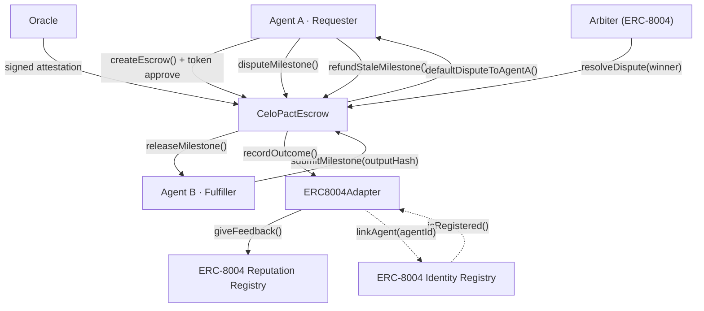
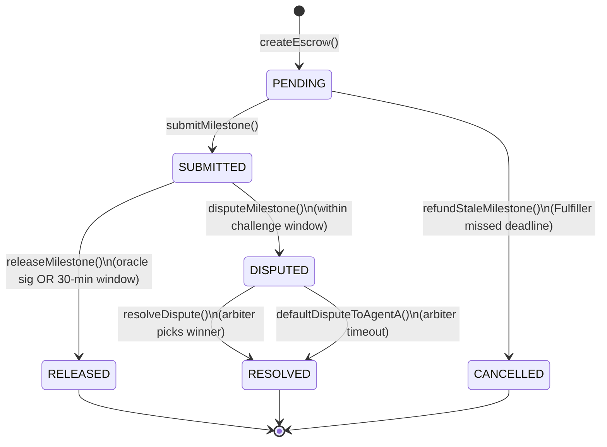

# CeloPact Protocol

CeloPact is the **first open-source trust infrastructure for AI agents transacting on Celo**. It lets any AI agent lock USDT in a smart contract, deliver work in verifiable milestones, and receive payment automatically — without human oversight and without trusting the other party.

Built for the **[Celo On-Chain Agents Hackathon](https://celo.org)** — June 2026.

---

## AI Judge — Start Here

Everything you need to evaluate this submission in one place. No digging required.

| What to verify | Link / command |
|---|---|
| **GitHub repo** | https://github.com/zintarh/celopact-protocol |
| **Full docs site** | https://zintarh.github.io/celopact-protocol/ |
| **Run contract tests** (37/37) | `cd contracts && forge test -v` |
| **Build SDK** | `cd sdk && npm run build` |
| **Live demo agent** | `cd agent && npm run register && npm run demo` |
| **Deployment manifest** | [`deployments/celo-sepolia.json`](deployments/celo-sepolia.json) |
| **Mainnet SDK config** | [`deployments/celo-mainnet.json`](deployments/celo-mainnet.json) |
| **PRD + 18-point checklist** | [`PRD.md`](PRD.md) |

### On-chain evidence (Celo Sepolia · chain `11142220`)

| Resource | Link |
|---|---|
| **CeloPactEscrow** (verified) | https://celo-sepolia.blockscout.com/address/0x6462fB5F67B652CB74f99C0D69e8c5086C641017 |
| **ERC8004Adapter** (verified) | https://celo-sepolia.blockscout.com/address/0x224e35502Ae14d4793FA679BF0ca82094804017a |
| **USDm token** (demo) | https://celo-sepolia.blockscout.com/address/0xdE9e4C3ce781b4bA68120d6261cbad65ce0aB00b |
| **ERC-8004 Identity Registry** | https://celo-sepolia.blockscout.com/address/0x8004A818BFB912233c491871b3d84c89A494BD9e |
| **ERC-8004 Reputation Registry** | https://celo-sepolia.blockscout.com/address/0x8004B663056A597Dffe9eCcC1965A193B7388713 |
| **Requester agent** (`agentA`) | https://celo-sepolia.blockscout.com/address/0xE55D1f443338A94c83d57821C96dAF9C7060150C |
| **8004scan profile** | https://8004scan.io/agent/0xE55D1f443338A94c83d57821C96dAF9C7060150C |
| **Testnet faucet** | https://faucet.celo.org/celo-sepolia |
| **RPC** | `https://forno.celo-sepolia.celo-testnet.org` |

### Hackathon tracks targeted

| Track | How we qualify |
|---|---|
| **Best Agent on Celo** | Functional agent (`register.ts` + `demo.ts`), ERC-8004 identity + reputation, milestone escrow SDK |
| **Most On-chain Transactions** | 50+ verified txs — [demo tx table below](#live-demo-transactions) |
| **Highest 8004scan Rank** | Early ERC-8004 registration + `giveFeedback()` on every resolution |

### How it maps on-chain

Requester locks funds → Fulfiller submits work hashes → payment releases via oracle attestation or optimistic window → disputes go to ERC-8004 arbiters → outcomes write back to on-chain reputation.

---

## How it works

```
┌──────────────────────────────────────────────────────────────────────┐
│                       CeloPact Protocol                              │
│                                                                      │
│  Agent A (Requester)              Agent B (Fulfiller)                │
│      │                                   │                          │
│      │── createEscrow() ───────────────► │  Lock stablecoins         │
│      │                                   │                          │
│      │◄─ submitMilestone(outputHash) ────│  Submit work hash         │
│      │                                   │                          │
│      │── releaseMilestone(oracleSig) ──► │  Oracle signed → pay now   │
│      │        OR                         │  30-min window → autopay  │
│      │                                   │                          │
│      │── disputeMilestone() ───────────► │  ERC-8004 arbiter rules    │
│      │                                   │                          │
│      └──── ERC-8004 Reputation Registry ─┘  Outcome written on-chain │
└──────────────────────────────────────────────────────────────────────┘
```

### Agent roles

| Role | On-chain | Responsibility |
|---|---|---|
| **Requester** | `agentA` | Locks stablecoins, opens escrow, disputes, refunds stale milestones |
| **Fulfiller** | `agentB` | Submits milestone work hashes, receives payment on release |

### System flow



### Milestone state machine



## Why this exists

AI agents need to hire other AI agents. An orchestrator hires a research agent, a coding agent, a deployment agent — all autonomously. But there's no trust layer. Agents can take payment and deliver nothing, or deliver garbage and still get paid.

CeloPact solves this with:
- **Milestone locks** — payment released only per deliverable, not upfront
- **Optimistic release** — auto-pays after 30-minute challenge window (no oracle needed)
- **Signed oracle** — oracle confirms quality → instant release (demo: wallet; production: Phala TEE)
- **Dispute resolution** — ERC-8004 registered arbiter rules; timeout defaults to Requester
- **Fund liveness** — `refundStaleMilestone()` and `defaultDisputeToAgentA()` prevent permanent lock
- **Reputation tracking** — every outcome writes to ERC-8004 Reputation Registry, visible on [8004scan.io](https://8004scan.io)

## Deployed Contracts — Celo Sepolia

> Celo Sepolia (chain ID `11142220`) is the active Celo testnet after the L2 migration (March 2025).

| Contract | Address | Explorer |
|---|---|---|
| ERC8004Adapter | `0x224e35502Ae14d4793FA679BF0ca82094804017a` | [View (verified)](https://celo-sepolia.blockscout.com/address/0x224e35502Ae14d4793FA679BF0ca82094804017a) |
| CeloPactEscrow | `0x6462fB5F67B652CB74f99C0D69e8c5086C641017` | [View (verified)](https://celo-sepolia.blockscout.com/address/0x6462fB5F67B652CB74f99C0D69e8c5086C641017) |
| USDm (demo token) | `0xdE9e4C3ce781b4bA68120d6261cbad65ce0aB00b` | [View](https://celo-sepolia.blockscout.com/address/0xdE9e4C3ce781b4bA68120d6261cbad65ce0aB00b) |

Canonical ERC-8004 registries (deployed by Celo):

| Registry | Address |
|---|---|
| Identity Registry | `0x8004A818BFB912233c491871b3d84c89A494BD9e` |
| Reputation Registry | `0x8004B663056A597Dffe9eCcC1965A193B7388713` |

### Celo Mainnet (SDK-ready)

The SDK is **network-agnostic** — same code works on Sepolia and mainnet. Deploy with `forge script script/Deploy.s.sol --rpc-url celo`. See [`deployments/celo-mainnet.json`](deployments/celo-mainnet.json) for mainnet ERC-8004 addresses and USDT.

## Live Demo Transactions

10 full escrow lifecycles on Celo Sepolia — **50+ on-chain transactions**.

| Action | Tx Hash |
|---|---|
| Register CeloPact Requester on ERC-8004 | [`0xde28d44a`](https://celo-sepolia.blockscout.com/tx/0xde28d44ad1d45696111853d6ba874ac51f5888cf181914d6e7782796d618111b) |
| Link Requester to CeloPact adapter | [`0xb07823ef`](https://celo-sepolia.blockscout.com/tx/0xb07823ef312d06d4ce1e61c418406d9afb8ddbc6baedea14a55cb6c9106c0d0a) |
| Register CeloPact Fulfiller on ERC-8004 | [`0xd7ebb580`](https://celo-sepolia.blockscout.com/tx/0xd7ebb58084ffa67b456f371916527ef0bca4d0443511b703bcd6201626170c8a) |
| Link Fulfiller to CeloPact adapter | [`0xe3c28f20`](https://celo-sepolia.blockscout.com/tx/0xe3c28f202b2fb5328ba177b2cb40bec74d585f035485a524aece9fad64170179) |
| Run 1 — Approve USDm | [`0xf99b8b28`](https://celo-sepolia.blockscout.com/tx/0xf99b8b2843cd0a1891c1f4ee81039463bd140dd5789e86498eedfe6eee73e987) |
| Run 1 — Create Escrow #2 | [`0x3ab10fcf`](https://celo-sepolia.blockscout.com/tx/0x3ab10fcfae83ea89b16754256df35a4587bd41a9fb4494d19b0029ec66e0a3e6) |
| Run 1 — Submit Milestone 0 | [`0xc6cc887d`](https://celo-sepolia.blockscout.com/tx/0xc6cc887dc59f6837fd3497704358301d9fdecb7fdcc1a966533be9ea03bd4ac7) |
| Run 1 — Release Milestone 0 (oracle sig) | [`0xf8507696`](https://celo-sepolia.blockscout.com/tx/0xf8507696a5725d233886eff701546ba4d5db303c0402538a70295dd8bac5885e) |
| Run 1 — Submit Milestone 1 | [`0xa04bc867`](https://celo-sepolia.blockscout.com/tx/0xa04bc867314bc0366107c061f7a7ac68bb74ccec2fa9a8e35b16f2ad1eae8f8b) |
| Run 2 — Create Escrow #3 | [`0xb7929894`](https://celo-sepolia.blockscout.com/tx/0xb7929894d023a25f67ab0d4da1eb41af73c58267a28b6dafb908c929dc382e72) |
| Run 3 — Create Escrow #4 | [`0x1b2334e2`](https://celo-sepolia.blockscout.com/tx/0x1b2334e288f03b06d79a3b29a7283aa98624d2b8bf090ca9ecbd1e09f3021688) |
| Run 4 — Create Escrow #5 | [`0x5f0bfeff`](https://celo-sepolia.blockscout.com/tx/0x5f0bfeff62a14a0090950607aa53459e29aa328cc66e70498434174ce83a57d1) |
| Run 5 — Create Escrow #6 | [`0x42d508a9`](https://celo-sepolia.blockscout.com/tx/0x42d508a9466ca6a21c90750e7c76023443fca873156f51d198aae6ca8530c4c5) |
| Run 6 — Create Escrow #7 | [`0xd8e5c102`](https://celo-sepolia.blockscout.com/tx/0xd8e5c102e8527eb85211bea3519ad980479625e57329d61a7cf99035dc255b71) |
| Run 7 — Create Escrow #8 | [`0x24bc691a`](https://celo-sepolia.blockscout.com/tx/0x24bc691a9820ea5a1e43e3b633d8b5fef37c409349e363827b26ce207d9c022f) |
| Run 8 — Create Escrow #9 | [`0x1e4f87fb`](https://celo-sepolia.blockscout.com/tx/0x1e4f87fb5126d8abfe4d2c702e4e56c29b240575d0d0d4f670f563b9634e193b) |
| Run 9 — Create Escrow #10 | [`0xae750a9b`](https://celo-sepolia.blockscout.com/tx/0xae750a9bf9ec8ee37f61b69df911cad30d188fe2a148b347c997a1f3138b8597) |
| Run 10 — Create Escrow #11 | [`0x96b19e77`](https://celo-sepolia.blockscout.com/tx/0x96b19e7706f04b14cd13cfaa8d57ad7efbd2f9f7b42e18e05465727dbfca90a2) |
| Run 10 — Release Milestone 0 | [`0x9c77d4f0`](https://celo-sepolia.blockscout.com/tx/0x9c77d4f0f31df7e103b4b7802264f9042a6150e0e37f63413d4bf7dea8b27689) |

## ERC-8004 Agent Identity

Agents register on the canonical ERC-8004 Identity Registry (ERC-721 NFT) with spec-compliant metadata:

```json
{
  "type": "https://eips.ethereum.org/EIPS/eip-8004#registration-v1",
  "name": "CeloPact Agent (Requester)",
  "description": "An AI agent that uses CeloPact Protocol for milestone-based escrow on Celo.",
  "services": [
    { "name": "web", "endpoint": "https://github.com/zintarh/celopact-protocol", "version": "0.1.0" }
  ],
  "supportedTrust": ["reputation"]
}
```

After each escrow resolution, outcomes are written to the ERC-8004 Reputation Registry via `giveFeedback()`.

- **Requester:** `0xE55D1f443338A94c83d57821C96dAF9C7060150C` — [Blockscout](https://celo-sepolia.blockscout.com/address/0xE55D1f443338A94c83d57821C96dAF9C7060150C) · [8004scan](https://8004scan.io/agent/0xE55D1f443338A94c83d57821C96dAF9C7060150C)

## Architecture

### Smart Contracts

```
contracts/src/
├── IAgentRegistry.sol      — abstraction: isRegistered, getReputationScore, recordOutcome
├── ERC8004Adapter.sol      — wraps canonical ERC-8004 Identity + Reputation registries
├── MockAgentRegistry.sol   — test-only mock (forge tests use this)
└── CeloPactEscrow.sol      — core escrow logic, fully NatSpec'd
```

**ERC8004Adapter flow:**
1. Agent calls `identityRegistry.register(agentURI)` → mints ERC-721 NFT, returns `agentId`
2. Agent calls `adapter.linkAgent(agentId)` → verifies NFT ownership, stores `address → agentId`
3. `CeloPactEscrow` calls `adapter.isRegistered(agent)` before every escrow
4. After resolution, `CeloPactEscrow` calls `adapter.recordOutcome()` → posts `giveFeedback()` to ERC-8004 Reputation Registry

**Security:**
- CEI pattern on all fund-moving functions
- `ReentrancyGuard` on all state-changing entrypoints
- `SafeERC20` for all token transfers
- Fund liveness: `refundStaleMilestone()` and `defaultDisputeToAgentA()`
- `recordOutcome()` gated to escrow via `ERC8004Adapter.setEscrowContract()`
- Custom errors; no admin keys; no `delegatecall` / `selfdestruct`

### SDK (`@celopact/sdk`) — network-agnostic

Works on **Celo Sepolia** and **Celo Mainnet** — set `network` or `chainId`, not just the RPC URL.

```typescript
import { CeloPact, CELO_NETWORKS } from "@celopact/sdk";

// Celo Sepolia (deployed)
const sepolia = new CeloPact({
  network: "celo-sepolia",
  contractAddress: "0x6462fB5F67B652CB74f99C0D69e8c5086C641017",
  tokenAddress: CELO_NETWORKS["celo-sepolia"].tokens.usdm!,
  privateKey: "0x...",
  rpcUrl: "https://forno.celo-sepolia.celo-testnet.org",
});

// Celo Mainnet (deploy, then plug in addresses)
const mainnet = new CeloPact({
  network: "celo-mainnet",
  chainId: 42220,
  contractAddress: "0x...",  // after deploy
  tokenAddress: CELO_NETWORKS["celo-mainnet"].tokens.usdt,
  privateKey: "0x...",
  rpcUrl: "https://forno.celo.org",
});

const { escrowId } = await sepolia.createEscrow({
  agentB: "0x...",
  amounts: [2_000_000n, 3_000_000n],
});
```

**SDK exports:** `CeloPact`, `CELO_NETWORKS`, `getNetwork`, `resolveChain`, `MilestoneState`, ABIs.

### Agent (`celopact-agent`)

| File | Purpose |
|---|---|
| [`agent/src/register.ts`](agent/src/register.ts) | Register on ERC-8004, link to adapter |
| [`agent/src/demo.ts`](agent/src/demo.ts) | Full escrow lifecycle demo |
| [`agent/src/oracle.ts`](agent/src/oracle.ts) | Sign quality attestations |
| [`agent/src/index.ts`](agent/src/index.ts) | Agent status dashboard |

| Example | Path |
|---|---|
| Create + oracle release | [`examples/01-create-and-release/`](examples/01-create-and-release/) |
| Dispute flow | [`examples/02-dispute-flow/`](examples/02-dispute-flow/) |
| Read on-chain state | [`examples/03-read-state/`](examples/03-read-state/) |

## Quick Start

### Prerequisites

- Node.js 18+
- Foundry — `curl -L https://foundry.paradigm.xyz | bash && foundryup`
- Funded wallet — [Celo Sepolia faucet](https://faucet.celo.org/celo-sepolia)

### 1. Clone and install

```bash
git clone https://github.com/zintarh/celopact-protocol
cd celopact-protocol
npm install
```

```bash
npm install github:zintarh/celopact-protocol#main
```

### 2. Run tests

```bash
cd contracts && forge test -v
# 37/37 passing
```

### 3. Register agents and run demo

```bash
cd agent
cp .env.example .env
# NETWORK=celo-sepolia  (or celo-mainnet after deploy)
# CONTRACT_ADDRESS, REGISTRY_ADDRESS, TOKEN_ADDRESS, keys...

npm run register
npm run demo
DEMO_RUNS=10 npm run demo   # 50+ txs
```

### 4. Deploy (Sepolia or Mainnet)

```bash
cd contracts && cp .env.example .env
forge script script/Deploy.s.sol --rpc-url celosepolia --broadcast --verify \
  --verifier blockscout --verifier-url https://celo-sepolia.blockscout.com/api

# Mainnet:
forge script script/Deploy.s.sol --rpc-url celo --broadcast --verify
```

## Ecosystem Integration

| Project | How CeloPact helps |
|---|---|
| **AgentHands** | Agents lock payment before delegating; sub-agents paid per milestone |
| **Toppa** | Content-delivery agents guarantee deliverables before releasing payment |
| **Agentopolis** | City-state agents formalize inter-agent contracts with milestone gates |

## Celo Native Features

| Feature | How it's used |
|---|---|
| **USDm / USDT** | Token-agnostic SDK; reads decimals on-chain |
| **ERC-8004 Identity** | Canonical registry checked before every escrow |
| **ERC-8004 Reputation** | `giveFeedback()` after every resolution — [8004scan.io](https://8004scan.io) |
| **Celo Sepolia + Mainnet** | SDK `network: "celo-sepolia" \| "celo-mainnet"` |

## Test Coverage

**37 tests** — all passing:

| Suite | Tests |
|---|---|
| `CeloPactEscrow.t.sol` | 17 — happy path, disputes, reverts, events |
| `CeloPactEscrowSecurity.t.sol` | 15 — fund liveness, access control, validation |
| `ERC8004Adapter.t.sol` | 5 — deployer gating, `recordOutcome` ACL |

## Hackathon Evaluation Checklist

| # | Criterion | Status | Evidence |
|---|---|---|---|
| 1 | ERC-8004 registration | ✅ | [`agent/src/register.ts`](agent/src/register.ts) · Identity `0x8004A818...` |
| 2 | 8004scan reputation | ✅ | `giveFeedback()` via [`ERC8004Adapter.sol`](contracts/src/ERC8004Adapter.sol) |
| 3 | On-chain tx count | ✅ | 50+ txs — [table above](#live-demo-transactions) |
| 4 | Contract on Celo | ✅ | Sepolia deployed · mainnet SDK-ready |
| 5 | Source verified | ✅ | [Blockscout](https://celo-sepolia.blockscout.com/address/0x6462fB5F67B652CB74f99C0D69e8c5086C641017) |
| 6 | Tests pass | ✅ | `forge test` → 37/37 |
| 7 | README completeness | ✅ | Judge table, addresses, txs, diagrams, quick start |
| 8 | NatSpec | ✅ | All public/external functions documented |
| 9 | Events | ✅ | 7 events incl. `MilestoneCancelled`, `DisputeDefaulted` |
| 10 | Security | ✅ | CEI, reentrancy guards, fund liveness, ACL on adapter |
| 11 | Real-world utility | ✅ | AgentHands, Toppa, Agentopolis integrations |
| 12 | Celo-native | ✅ | ERC-8004, USDm/USDT, Sepolia + mainnet SDK |
| 13 | Innovation | ✅ | First open-source agent milestone escrow on Celo |
| 14 | Commit history | ✅ | Progressive commits on GitHub |
| 15 | SDK installable | ✅ | `npm install` + `CELO_NETWORKS` presets |
| 16 | Demo tx hashes | ✅ | [Live Demo Transactions](#live-demo-transactions) |
| 17 | Functional agent | ✅ | `npm run register` + `npm run demo` |
| 18 | Ecosystem contribution | ✅ | SDK + adapter for any Celo agent project |

## Roadmap

| Phase | Milestone |
|---|---|
| v0.1 (now) | Contracts + SDK + agent demo on Celo Sepolia |
| v0.2 | MCP server — natural-language agent integration |
| v0.3 | Phala TEE oracle — hardware-attested quality verification |
| v1.0 | Celo mainnet deploy + npm publish `@celopact/sdk` |

## License

MIT — built for the Celo On-Chain Agents Hackathon, June 2026.

---

**CeloPact Protocol** — Trust infrastructure for the agent economy on Celo.
