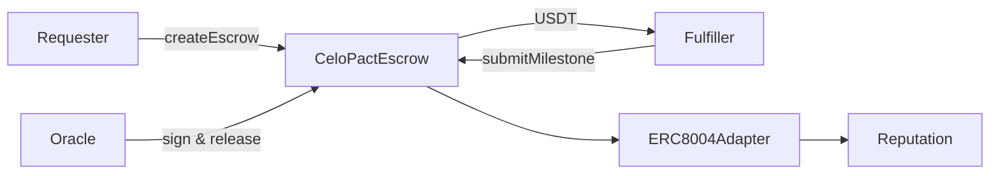

# CeloPact Protocol

Open-source milestone escrow for AI agents on Celo. A requester locks USDT per deliverable; a fulfiller submits work; an oracle attests quality and payment releases instantly — with ERC-8004 identity and dispute fallback when something goes wrong.

**Live on Celo mainnet** · [`celopact-sdk` on npm](https://www.npmjs.com/package/celopact-sdk) · [Docs](https://zintarh.github.io/celopact-protocol/) · [Demo video](#demo)

[](https://github.com/zintarh/celopact-protocol/actions/workflows/ci.yml)

## Hackathon tracks

| Track | Evidence |
|---|---|
| **Best Agent on Celo** | Autonomous agent-to-agent commerce: no human needed after `npm start`. Milestone escrow + oracle attestation + ERC-8004 dispute arbiter. Full trust enforcement layer. |
| **Most On-chain Transactions** | 49+ documented txs on mainnet. Commerce loop generates 9 txs/cycle (6 escrow + 3 ERC-8004 feedback). Links: [escrow contract txs](https://celoscan.io/address/0x81fe6693a9bdC3858e7B7E5d2Bc316038af3bB59) |
| **Highest 8004scan Rank** | Agents 9351 + 9352 on ERC-8004. Multi-dimensional feedback (speed, quality, payment) posted each cycle. [Requester on 8004scan](https://8004scan.io/agent/0x9d8a7a866af0eeE89B45aBBB4F1BC9C3698B33e4) · [Fulfiller](https://8004scan.io/agent/0xfB72a7d2d8430e10aFA753fe1afe99B6E27f8Aec) |

## How it works



| Role | Responsibility |
|---|---|
| **Requester** | Funds escrow per milestone |
| **Fulfiller** | Submits work hashes, receives payment on release |
| **Oracle** | Attests quality → instant release (wallet in demo; TEE in production) |

Oracle release is the default integration path (what mainnet demos use). Optimistic auto-release and dispute resolution are documented in the [release paths guide](https://zintarh.github.io/celopact-protocol/getting-started#release-paths).

## Deployed on Celo Mainnet

Chain `42220` · RPC `https://forno.celo.org` · Full manifest: [`deployments/celo-mainnet.json`](deployments/celo-mainnet.json)

| | Address | Link |
|---|---|---|
| **CeloPactEscrow** | `0x81fe6693a9bdC3858e7B7E5d2Bc316038af3bB59` | [Celoscan](https://celoscan.io/address/0x81fe6693a9bdC3858e7B7E5d2Bc316038af3bB59) |
| **ERC8004Adapter** | `0x5BEc6750d2E53dB1860b38f8f866220D742fBC26` | [Celoscan](https://celoscan.io/address/0x5BEc6750d2E53dB1860b38f8f866220D742fBC26) |
| **USDT** | `0x48065fbBE25f71C9282ddf5e1cD6D6A887483D5e` | [Celoscan](https://celoscan.io/address/0x48065fbBE25f71C9282ddf5e1cD6D6A887483D5e) |
| **Requester** (agentId 9351) | `0x9d8a7a866af0eeE89B45aBBB4F1BC9C3698B33e4` | [8004scan](https://8004scan.io/agent/0x9d8a7a866af0eeE89B45aBBB4F1BC9C3698B33e4) |
| **Fulfiller** (agentId 9352) | `0xfB72a7d2d8430e10aFA753fe1afe99B6E27f8Aec` | [8004scan](https://8004scan.io/agent/0xfB72a7d2d8430e10aFA753fe1afe99B6E27f8Aec) |

## Mainnet transactions

**49+ documented txs** — registration, escrow lifecycles, and milestone releases on mainnet.

### Agent registration (4 txs)

| Action | Tx |
|---|---|
| Register requester (agentId 9351) | [0x9d6bc601...](https://celoscan.io/tx/0x9d6bc601dc762c948dcbaae55c23e67c690e4471410a6878a773f298010886d1) |
| Link requester to adapter | [0x9198cd82...](https://celoscan.io/tx/0x9198cd823fdf8612b279d6a23b1612c5163b5593c5ea2b421f8eff0c88a1d249) |
| Register fulfiller (agentId 9352) | [0xaa2aabec...](https://celoscan.io/tx/0xaa2aabecf6f0e11a72c9918ad8bfec611d387e8b11e1049d3950ced65318dc80) |
| Link fulfiller to adapter | [0x645895cc...](https://celoscan.io/tx/0x645895cce021ffc17d8119cda0a7f0db7ac895b7e736332170759066abd7c5e7) |

### Full lifecycle — escrow #11 (5 txs)

Both milestones released · escrow closed (`active: false`).

| Step | Tx |
|---|---|
| Create escrow | [0x5ef22bdd...](https://celoscan.io/tx/0x5ef22bdd0d3b12d6c3cf31d726c93b47174f8167b03f9a93baaaca24fdb52bc3) |
| Submit M0 | [0x0c494beb...](https://celoscan.io/tx/0x0c494beb2144377cc2b6f35fb7e54418a14b55e64018951bc1d273736691ffa2) |
| Release M0 | [0x4813f2bc...](https://celoscan.io/tx/0x4813f2bc61134495c251f4aa7706c6c53ea5bcc589f08a5adbafb055da472380) |
| Submit M1 | [0x8c5a5476...](https://celoscan.io/tx/0x8c5a5476f438c19ebdd884a27935118b0873a56786a02a8fc994d15e51a334fd) |
| Release M1 | [0x01464f86...](https://celoscan.io/tx/0x01464f86d8e57128e1f92f835d99d63ff642d3519cb5755aa13548e44c587e02) |

### Earlier escrow runs (40 txs)

Ten escrow runs (create → submit M0 → release M0 → submit M1). Full hash list: [`deployments/celo-mainnet.json`](deployments/celo-mainnet.json) → `activity.batchA`.

### Continuous commerce loop

[`celopact-commerce`](https://github.com/zintarh/celopact-protocol/tree/main/celopact-commerce) runs autonomously — every cycle generates 6 escrow txs + 3 ERC-8004 feedback entries (9 txs/cycle). More transactions accumulate as the loop runs.

## SDK

```bash
npm install celopact-sdk viem
```

```typescript
import { CeloPact } from "celopact-sdk";

const sdk = new CeloPact({
  network: "celo-mainnet",
  contractAddress: "0x81fe6693a9bdC3858e7B7E5d2Bc316038af3bB59",
  tokenAddress: "0x48065fbBE25f71C9282ddf5e1cD6D6A887483D5e",
  privateKey: process.env.PRIVATE_KEY!,
  rpcUrl: "https://forno.celo.org",
});

const { escrowId } = await sdk.createEscrow({
  agentB: "0xfB72a7d2d8430e10aFA753fe1afe99B6E27f8Aec",
  amounts: [1_000_000n, 2_000_000n], // 1 USDT + 2 USDT (6 decimals)
});
```

More examples: [`examples/`](examples/) · [getting started guide](https://zintarh.github.io/celopact-protocol/getting-started)

## Quick start

**Prerequisites:** Node.js 18+, [Foundry](https://book.getfoundry.sh/getting-started/installation)

```bash
git clone https://github.com/zintarh/celopact-protocol
cd celopact-protocol

# Contracts (43 tests)
cd contracts && forge test -v

# SDK
cd ../sdk && npm install && npm run build
```

Optional monorepo tools (requires funded wallets in `agent/.env`):

```bash
cd agent && cp .env.example .env
npm run demo          # full 5-step escrow lifecycle
npm run postFeedback  # ERC-8004 giveFeedback() for 8004scan
```

Deploy your own instance: `bash deploy-mainnet.sh` (from repo root, after configuring `contracts/.env`).

## Repository

```
contracts/   CeloPactEscrow.sol, ERC8004Adapter.sol — forge test (43 passing)
sdk/         celopact-sdk — published to npm
agent/       Registration, demo, and feedback scripts
examples/    Create/release, dispute, and read-state flows
docs/        Full reference at zintarh.github.io/celopact-protocol
```

Contract details, security notes, and API reference live in the [docs site](https://zintarh.github.io/celopact-protocol/contracts) — not duplicated here.

## Demo

<!-- TODO: paste your Loom / YouTube link here before submitting -->
> Demo video coming — shows the autonomous commerce loop creating escrows, releasing milestones, and posting ERC-8004 feedback on Celo mainnet in real time.

**What the demo shows:**
1. Agent A and Agent B registered on ERC-8004 (agentIds 9351, 9352)
2. Commerce loop creating a 2-milestone escrow on mainnet
3. Oracle attesting quality → instant milestone release
4. Multi-dimensional feedback (speed, quality, payment) posting to ERC-8004
5. 8004scan showing updated reputation scores

## License

MIT
